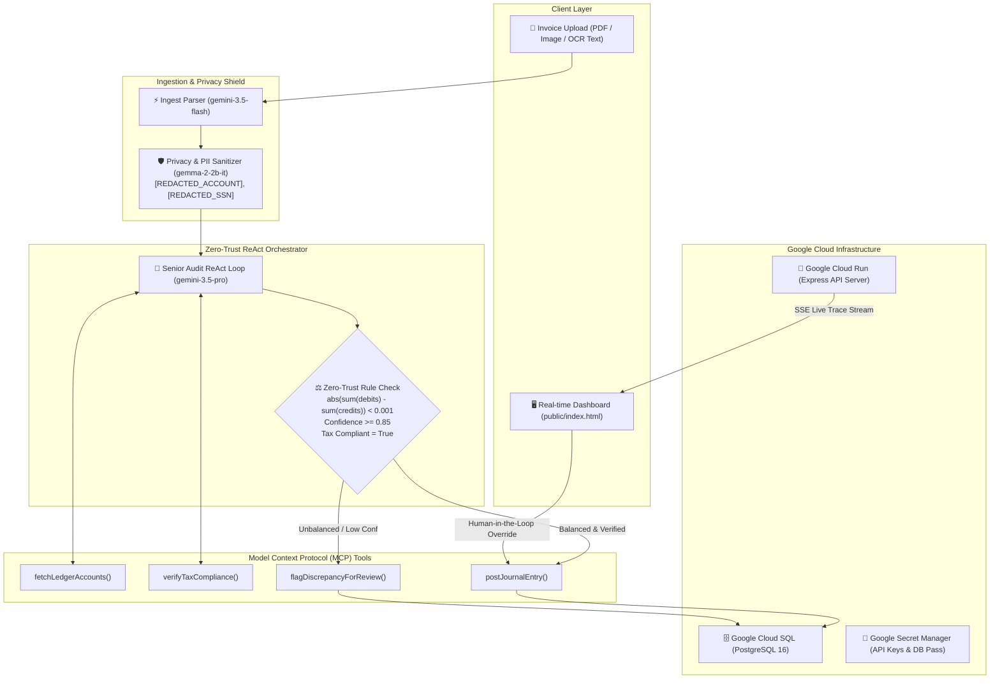

# 🛡️ AgentLedger: Autonomous Zero-Trust Accounting & Ledger Fleet

[](https://devpost.com)
[](https://devpost.com)
[](https://ai.google.dev)
[](https://cloud.google.com)

> **AgentLedger** is an enterprise-grade, zero-trust autonomous agent fleet that parses financial documents, sanitizes private employee/banking data with **Gemma 2 2B IT**, audits tax compliance, mathematically enforces double-entry balance constraints with **Gemini 3.5 Pro** via **Model Context Protocol (MCP)**, and commits verified transactions to **Google Cloud SQL (PostgreSQL)** in real time.

---

## 🎯 Hackathon Track & Category

* **Track**: **The Fortified Enterprise Fleet** *(Zero-trust network of agents with security, privacy governance, mathematical guardrails, and MCP multi-agent tool calling).*
* **Google Models Used**:
  * ⚡ **`gemini-3.5-flash`**: High-speed multimodal invoice and receipt parsing into strict financial JSON schemas.
  * 🧠 **`gemini-3.5-pro`**: Multi-turn ReAct reasoning loop, account mapping, tax compliance auditing, and MCP tool execution.
  * 🛡️ **`gemma-2-2b-it`**: Privacy shield redacting sensitive bank accounts, SSNs, and employee identities into privacy tokens before reasoning.
* **Google Agent Frameworks**: `@google/genai` (Google Gen AI SDK for TypeScript), `@modelcontextprotocol/sdk` (Model Context Protocol).
* **Google Cloud Services**: **Cloud Run**, **Cloud SQL (PostgreSQL)**, **Secret Manager**, **Artifact Registry**, **Cloud Build**.

---

## 🏗️ System Architecture



---

## 🚀 Key Features

### 1. 🛡️ Zero-Trust Accounting Guardrails
* **No Financial Hallucinations**: Enforces `abs(sum(debits) - sum(credits)) < 0.001` at the tool layer. Unbalanced entries are mathematically blocked from committing to PostgreSQL.
* **Low Confidence Safety Gate**: Extractions with confidence `< 0.85` or unaligned line totals automatically trigger [`flagDiscrepancyForReview`](file:///home/kajibik/Development/agent-ledger/src/mcp/ledgerTools.ts).

### 2. 🔒 Gemma 2 2B IT Privacy Shield
* Redacts sensitive bank account numbers, routing codes, SSNs, credit cards, and employee signers into tokens (`[REDACTED_ACCOUNT]`, `[REDACTED_SSN]`) before prompts reach the cloud reasoning model.

### 3. 🧠 Multi-Turn ReAct Loop via MCP Tools
* Coordinates chart-of-accounts discovery (`fetchLedgerAccounts`), vendor tax verification (`verifyTaxCompliance`), and atomic transaction posting (`postJournalEntry`) via standard Model Context Protocol declarations.

### 4. ⚡ Live Server-Sent Events (SSE) Trace Stream
* Streams Gemini 3.5 Pro **Thoughts**, **MCP Tool Invocations**, **Tool Observations**, and **Balance Updates** in real-time to the dark-mode dashboard.

### 5. ⚖️ Interactive Human-in-the-Loop (HITL) Queue
* Flagged transactions appear in the review queue with variance calculations and an **"Approve & Post"** override modal.

---

## ⚡ Quick Start (Run Locally in 2 Minutes)

### Prerequisites
* Node.js v20+
* Google Gemini API Key

### 1. Clone & Install Dependencies
```bash
git clone https://github.com/your-username/agent-ledger.git
cd agent-ledger
npm install
```

### 2. Configure Environment Variables
Copy `.env.example` to `.env` and insert your Gemini API Key:
```bash
cp .env.example .env
```
Edit `.env`:
```env
GEMINI_API_KEY="your-gemini-api-key"
PROJECT_ID="your-gcp-project-id"
PORT=8080
```

### 3. Run the Comprehensive Zero-Trust Audit Suite
```bash
npm run test:audit
```
*Executes all 9 automated audit checks verifying tool declarations, double-entry mathematical enforcement, low-confidence safety gates, and Gemma PII redaction.*

### 4. Run the 3-Scenario Autonomous Live Demo
```bash
npm run demo
```
*Simulates 3 real-world scenarios: (1) Balanced AWS Invoice $\rightarrow$ POSTED, (2) Unbalanced Invoice $\rightarrow$ REJECTED, and (3) Sensitive Low-Confidence Scan with PII $\rightarrow$ Human-in-the-Loop Approval.*

### 5. Start the Web Dashboard
```bash
npm run dev:server
```
Open **[http://localhost:8080](http://localhost:8080)** in your browser.

---

## ☁️ Google Cloud Run Deployment

AgentLedger is configured for one-command deployment to **Google Cloud Run** with native **Google Cloud SQL Proxy** integration.

### One-Command Deployment Script:
```bash
export PROJECT_ID="your-gcp-project-id"
export GEMINI_API_KEY="your-gemini-api-key"
export INSTANCE_CONNECTION_NAME="your-gcp-project:us-central1:your-postgres-db"
./deploy.sh
```

### What `deploy.sh` Does:
1. Enables Cloud Run, Cloud SQL Admin, Artifact Registry, and Secret Manager APIs.
2. Creates an Artifact Registry Docker repository in `us-central1`.
3. Builds the optimized multi-stage Docker container via Google Cloud Build.
4. Deploys to Cloud Run with native Cloud SQL Unix domain socket binding (`/cloudsql/INSTANCE_NAME`) and Secret Manager bindings.

---

## 🧪 Verification & Audit Matrix

| Audit Check | Component | Rule Enforced | Status |
| :--- | :--- | :--- | :---: |
| **Tool Declarations** | `src/mcp/ledgerTools.ts` | Exported with `@google/genai` `Type` enums & MCP schemas | ✅ PASS |
| **Account Discovery** | `fetchLedgerAccounts` | Dynamic classification of Assets, Liabilities, Equity, Expense | ✅ PASS |
| **Tax Verification** | `verifyTaxCompliance` | Tax ID format & 13% tax variance alignment check | ✅ PASS |
| **Double-Entry Balance** | `postJournalEntry` | Strict `sum(debits) === sum(credits)` | ✅ PASS |
| **Zero-Trust Block** | `postJournalEntry` | Blocks unbalanced entry ($200 variance) from PostgreSQL | ✅ PASS |
| **Discrepancy Logging**| `flagDiscrepancyForReview`| Persistent discrepancy queue with resolution workflow | ✅ PASS |
| **ReAct Loop** | `src/agent/orchestrator.ts`| Autonomous multi-turn reasoning with Gemini 3.5 Pro | ✅ PASS |
| **Safety Threshold** | `src/agent/orchestrator.ts`| Low confidence (`< 0.85`) triggers human audit gate | ✅ PASS |
| **PII Privacy Shield**| `src/agent/piiSanitizer.ts` | Gemma 2 2B IT tokenizes bank/SSN/employee data | ✅ PASS |

---

## 📂 Project Structure

```
agent-ledger/
├── .antigravity/
│   └── rules.md                  # Project rules and zero-trust constraints
├── public/
│   └── index.html                # Real-time SPA dashboard with live SSE trace viewer
├── src/
│   ├── agent/
│   │   ├── ingest.ts             # Gemini 3.5 Flash invoice parser with strict schema
│   │   ├── piiSanitizer.ts       # Gemma 2 2B IT privacy & PII redaction shield
│   │   ├── orchestrator.ts       # Gemini 3.5 Pro ReAct loop & MCP coordinator
│   │   └── prompts.ts            # Enterprise prompt templates
│   ├── mcp/
│   │   ├── ledgerTools.ts        # 4 Core MCP ledger tools with @google/genai Type enums
│   │   └── server.ts             # Model Context Protocol stdio server
│   ├── db/
│   │   ├── index.ts              # Robust PostgreSQL pool client with withTransaction()
│   │   └── schema.ts             # SQL migrations for double-entry ledger & discrepancies
│   ├── api/
│   │   ├── server.ts             # Express server with SSE streaming & HITL endpoints
│   │   └── routes.ts             # REST API routes
│   └── test/
│       ├── audit.ts              # Comprehensive 9-point zero-trust test runner
│       ├── demo.ts               # 3-scenario live autonomous audit demo
│       ├── piiSanitizerTest.ts   # PII redaction and preservation test suite
│       └── ledgerTest.ts         # Unit tests for MCP tools and balance verification
├── deploy.sh                     # Automated Google Cloud Run deployment script
├── Dockerfile                    # Multi-stage container optimized for Cloud Run
├── package.json
└── tsconfig.json
```

---

## 🏆 Hackathon Submission Notes

* **Category**: The Fortified Enterprise Fleet
* **Bonus Point Integrations**:
  * 💎 **Gemma 2 2B IT**: Embedded as an edge privacy shield redacting PII before cloud LLM reasoning.
  * 💎 **Full Google Cloud Stack**: Cloud Run + Cloud SQL PostgreSQL + Secret Manager + Cloud Build + Artifact Registry.
* **License**: MIT
